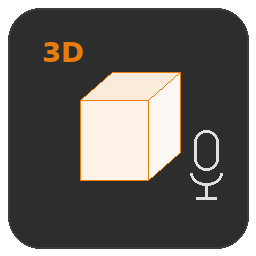
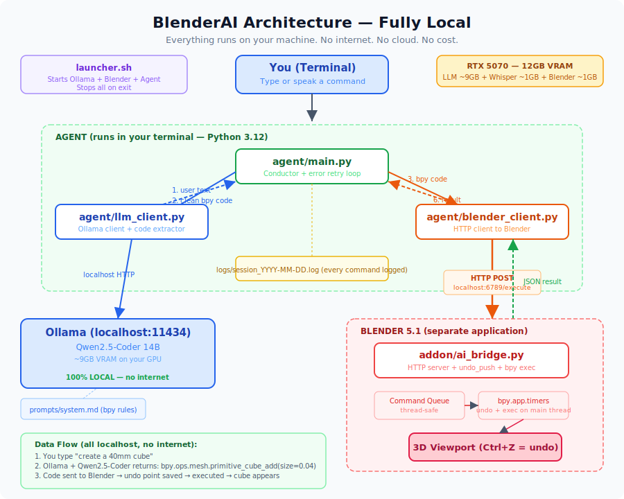

<p align="center">
  
</p>

<h1 align="center">3DPrintVoice</h1>

<p align="center">
  Talk to Blender. Build 3D-printable objects with your voice or keyboard.<br>
  Fully local — no cloud, no API keys, no cost per use.
</p>

<p align="center">
  <a href="LICENSE"></a>
  
  
  
</p>

---

## What Is This?

3DPrintVoice is a voice and text interface that lets you create 3D-printable objects in Blender using plain English. Instead of learning Blender's menus and shortcuts, you just say what you want:

```
"create a 40mm cube"
"make it hollow with 2mm walls"
"add a ball-and-socket joint for the shoulder"
"export all parts as STL"
```

A local AI model translates your words into Blender Python code and executes it. The result appears in the viewport instantly.

**79 commands** across 9 categories: shapes, transforms, booleans, hardware integration (screws, magnets, metal rods), articulation joints (ball-socket, ratchet, hinge), surface detail (panel lines, rivets), assembly testing, and STL export. Built specifically for designing complex multi-part 3D-printable assemblies.

Everything runs on your machine. No internet after setup. No subscription. No data leaves your computer.

---

## How It Works

```
You speak or type a command
    |
    v
Local AI model (Ollama + Qwen2.5-Coder, running on your GPU)
    |  translates English --> Python/bpy code
    v
HTTP bridge sends code to Blender addon
    |
    v
Result appears in Blender's 3D viewport
```

The system includes a setup wizard that detects your GPU and picks the best model automatically.

---

## Quick Start

### 1. Install Ollama (the local AI engine)

```bash
curl -fsSL https://ollama.com/install.sh | sudo sh
```

### 2. Install 3DPrintVoice

```bash
git clone https://github.com/RolandMJ/3d-print-voice.git
cd 3d-print-voice
./install.sh
```

The installer copies files to `/opt/3d-print-voice`, creates a Python virtual environment, installs dependencies, and adds a desktop menu entry.

### 3. Install the Blender addon

Open Blender, go to **Edit > Preferences > Get Extensions**, click **Install from Disk**, and select `addon/ai_bridge.py`. Enable it.

### 4. Launch

From the app menu (**Graphics > 3DPrintVoice**) or:

```bash
/opt/3d-print-voice/launcher.sh
```

On first launch, a setup wizard checks your system and downloads the right AI model for your GPU.

For detailed step-by-step instructions, see the [Setup Guide](docs/SETUP_GUIDE.md).

---

## What Can It Do?

Here are some things you can say or type. All dimensions are in millimeters.

### Basic shapes and transforms

| Say this | What happens |
|----------|-------------|
| "create a 40mm cube" | A cube appears |
| "create a cylinder 10mm radius 50mm tall" | Solid cylinder |
| "move it up by 30mm" | Moves the last object |
| "make it hollow with 1.5mm walls" | Hollows it for 3D printing |
| "subtract the Cylinder from the Cube" | Boolean cut |
| "round all edges with 1mm radius" | Smooth fillets |

### Multi-part assemblies with real tolerances

| Say this | What happens |
|----------|-------------|
| "create medium ball-and-socket joint" | 10mm ball + socket with print clearance |
| "create a snap-fit cap for it" | Snug fit (0.15mm clearance/side) |
| "add 6mm steel rod sleeve" | Channel for a metal rod |
| "add M4 DIN 912 counterbore" | Exact DIN-standard screw pocket |
| "split part at 50mm with zigzag" | Interlocking seam for oversize parts |
| "export all parts as STL" | One file per object |

### Scene awareness

The AI remembers what's in your scene. After each command, it reads all objects, their sizes, and positions. So you can say things like:

- "make it taller" — it knows which object and how tall it currently is
- "create a matching socket" — it reads the ball joint radius and adds clearance
- "move it next to the arm" — it reads the arm's position

### Assembly testing

Before printing dozens of parts, verify them virtually:

- "load full assembly" — imports all parts into one scene
- "check interference between A and B" — shows overlapping volume
- "test range of motion on right knee" — rotates joint, reports collision angles
- "check balance" — calculates center of gravity vs footprint

See the full [Command Cheat Sheet](docs/COMMAND_CHEATSHEET.md) for all 79 commands with examples.

---

## Requirements

| Requirement | Details |
|-------------|---------|
| **OS** | Linux (Ubuntu 22.04+, Linux Mint 21+) |
| **Blender** | 4.0 or newer (5.1+ recommended) |
| **Python** | 3.11+ |
| **GPU** | NVIDIA with 6GB+ VRAM |
| **Ollama** | Installed via official script (see Quick Start) |

The AI model tier depends on your GPU:

| VRAM | Model | Quality |
|------|-------|---------|
| 12GB+ | Qwen2.5-Coder 14B (Full) | Best — handles all 79 commands reliably |
| 6-11GB | Qwen2.5-Coder 7B (Medium) | Good — handles most commands well |

Voice input requires a microphone and ALSA (`arecord`). The MIC button disables automatically if no mic is detected.

---

## Architecture

<p align="center">
  
</p>

| Component | What it does |
|-----------|-------------|
| `addon/ai_bridge.py` | Blender addon — HTTP server that receives and executes Python code |
| `agent/app.py` | GUI control bar — buttons for voice, sync, slice, reference |
| `agent/llm_client.py` | Talks to Ollama, extracts code from model output |
| `agent/blender_client.py` | HTTP client — sends generated code to the Blender addon |
| `agent/voice.py` | Microphone capture + speech-to-text via faster-whisper |
| `prompts/system.md` | System prompt — the AI's knowledge of Blender's Python API |
| `launcher.sh` | One-click launcher — starts Ollama, Blender, and the GUI |

---

## Project Status

- [x] **Phase 1** — Text commands to Blender (local LLM via Ollama)
- [x] **Phase 2** — Voice input via faster-whisper
- [x] **Phase 2.5** — GUI control bar, installer, setup wizard
- [x] **Phase 3** — Scene context awareness, parametric properties, print bed warnings
- [ ] **Phase 4** — 3D print intelligence (overhang detection, wall thickness checks)

See the [Changelog](docs/CHANGELOG.md) for detailed release history.

---

## Documentation

| Document | Description |
|----------|-------------|
| [Setup Guide](docs/SETUP_GUIDE.md) | Step-by-step installation for beginners |
| [Command Cheat Sheet](docs/COMMAND_CHEATSHEET.md) | All 79 commands with examples |
| [Command Reference](docs/command-reference.html) | Interactive HTML reference (bilingual EN/DE) |
| [How It Works](docs/PROJECT_OVERVIEW.md) | Technical overview of the architecture |
| [Changelog](docs/CHANGELOG.md) | Version history and release notes |
| [IP Notice](docs/IP_NOTICE.md) | Copyright, AI disclosure, licensing details |

---

## Contributing

Contributions are welcome. See [CONTRIBUTING.md](CONTRIBUTING.md) for guidelines.

If you find a bug or have a feature idea, [open an issue](https://github.com/RolandMJ/3d-print-voice/issues).

---

## License

GPL-3.0 — free to use, modify, and distribute.

See [LICENSE](LICENSE) for the full text and [IP Notice](docs/IP_NOTICE.md) for AI-assisted development disclosure.

---

Built by [Roland Preisach](https://github.com/RolandMJ) with the help of local AI models and [Claude Code](https://claude.ai/claude-code).
